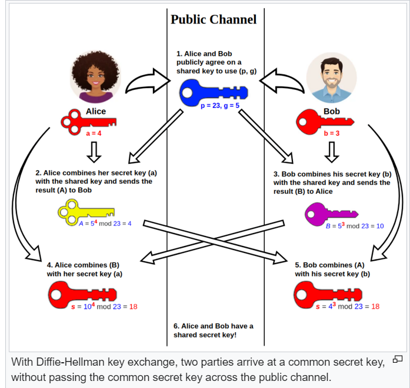

TLS
===

DH exchange
-----------

Diffie–Hellman key exchange is a mathematical method of securely exchanging cryptographic keys
over a public channel and was one of **the first public-key protocols**. 

DH is one of the earliest practical examples of public key exchange implemented within the field
of cryptography. Published in 1976 by Diffie and Hellman, this is the earliest publicly known work
that proposed the idea of a private key and a corresponding public key.

Traditionally, secure encrypted communication between two parties required that they first exchange
keys by some secure physical means, such as paper key lists transported by a trusted courier.
The Diffie–Hellman key exchange method allows two parties that have no prior knowledge of each other
to jointly establish a shared secret key over an insecure channel. This key can then be used to
encrypt subsequent communications using a symmetric-key cipher.

Cryptographic explanation
^^^^^^^^^^^^^^^^^^^^^^^^^

The simplest and the original implementation, later formalized as Finite Field Diffie-Hellman in RFC 7919,
of the protocol uses the multiplicative group of integers modulo p, where p is prime, and g is a
primitive root modulo p. 

#. Alice and Bob publicly agree to use a modulus p and base g 

#. Alice chooses a secret integer a, then sends Bob A = g^a mod p

#. Bob chooses a secret integer b, then sends Alice B = g^b mod p

#. Alice computes s = B^a mod p

#. Bob computes s = A^b mod p

Alice and Bob now share a secret. Both Alice and Bob have arrived at the same values.

Modular arithmetic Properties
^^^^^^^^^^^^^^^^^^^^^^^^^^^^^

Due to

then 

