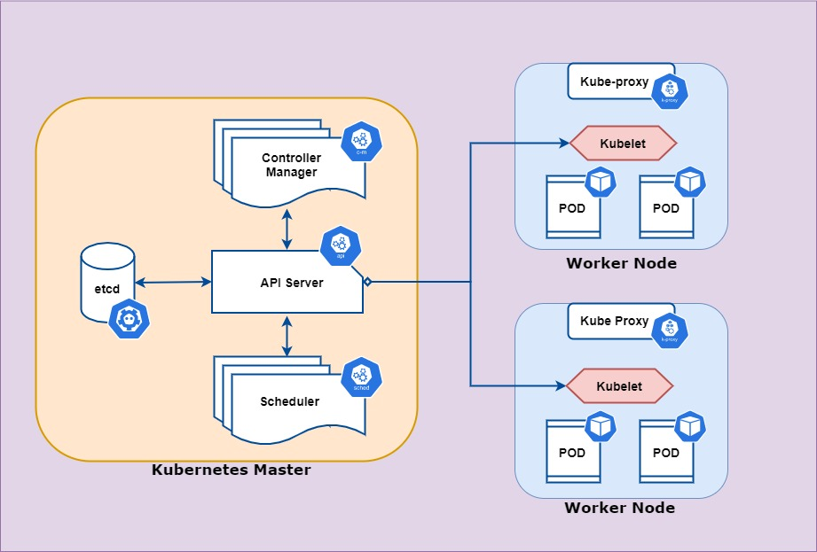

Introduction
============

Kubernetes is an open-source container orchestration system for automating software deployment, 
scaling, and management. Google originally designed Kubernetes, but the Cloud Native Computing
Foundation now maintains the project. - from Wikipedia

By the way, if you're wondering where the name “Kubernetes” came from, it is a Greek word, meaning
helmsman or pilot. The abbreviation K8s is derived by replacing the eight letters of “ubernete” with
the digit 8.

Architecture
------------

Master
------

Master consists of 4 components

#. **API Server**: It is the central touch point that is accessed by all users, automation, and components in the Kubernetes cluster. The API server implements a RESTful API over HTTP, performs all API operations, and is responsible for storing API objects into a persistent storage backend
#. **etcd**: etcd is a consistent and highly-available key value store used as Kubernetes' backing store for all cluster data
#. **Scheduler**: he Kubernetes scheduler is a control plane process which assigns Pods to Nodes. The scheduler determines which Nodes are valid placements for each Pod in the scheduling queue according to constraints and available resources. The scheduler then ranks each valid Node and binds the Pod to a suitable Node
#. **Controller manager**: The Kubernetes Controller Manager (also called kube-controller-manager) is a daemon that acts as a continuous control loop in a Kubernetes cluster. The controller monitors the current state of the cluster via calls made to the API Server, and changes the current state to match the desired state described in the cluster's declarative configuration. The Controller Manager does not directly modify resources in the Kubernetes cluster. Instead, it manages multiple controllers responsible for specific activities—including replication controllers, endpoint controllers, namespace controllers, and service account controllers.

Worker
------

Worker node consists of 3 components

#. **kubelet**: The Kubelet is responsible for managing the deployment of pods to Kubernetes nodes. It receives commands from the API server and instructs the container runtime to start or stop containers as needed.
#. **kubeproxy**: A network proxy running on each Kubernetes node. It is responsible for maintaining network rules on each node. Network rules enable network communication between nodes and pods. Kube-proxy can directly forward traffic or use the operating system packet filter layer. 
#. **container runtime**: The software layer responsible for running containers. There are several container runtimes supported by Kubernetes, including Containerd, CRI-O, Docker, and other Kubernetes Container Runtime Interface (CRI) implementations.