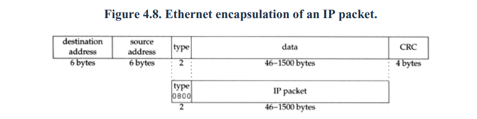
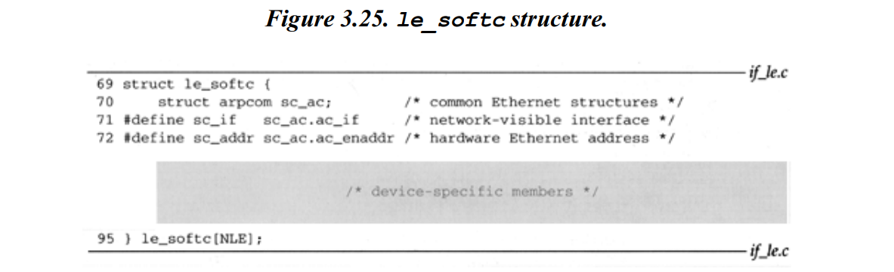
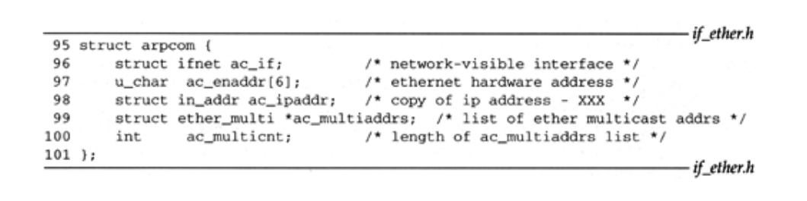
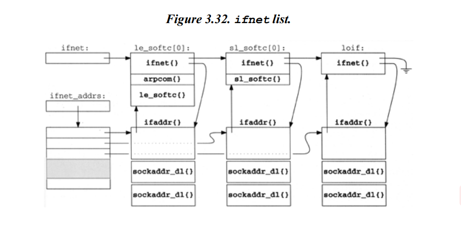
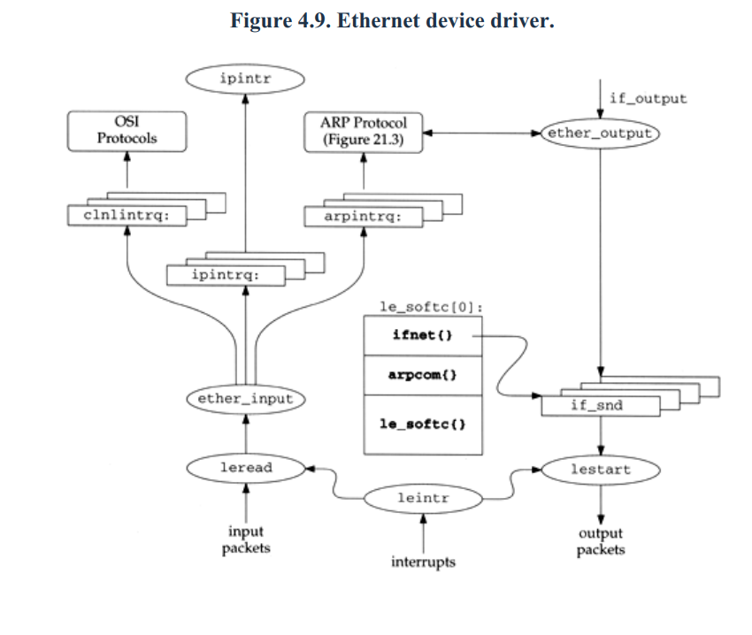

Ethernet
=========

ARP Protocol: The translation from IP to hardware addresses 

RARP Protocol: from hardware to IP addresses

初始化
------

作为cpu startup的一部分,内核查找任何连接的网络设备。一旦一个设备被识别,
专用的初始化函数会被调用。

设备驱动为network interface初始化一个专用 **ifnet** 结构，对于以太网来说，
专用结构为 **le_softc**.

所有的设备 **ifnet** 会形成一个链表

Input
-----

In normal operation, an Ethernet interface receives frames destined for 
its **unicast hardware address** and for the Ethernet **broadcast address**. 
When a complete frame is available, the interface generates an interrupt 
and the kernel calls **leintrt**

**leintr** examines the hardware and, if a frame has arrived, calls **leread** 
to transfer the frame from the interface to a chain of mbufs (with **m_devget**).

The **leread** function starts with a contiguous buffer of memory passed 
to it by **leintr** and constructs an **ether_header** structure and a chain of mbufs. 
The chain contains the data from the Ethernet frame. Then **leread** will call ether_input,
also passes the incoming frame to **BPF**.

**ether_input** examines the ether_header structure to determine the type of data.
**ether_input** places the packet on the selected queue or discards the packet 
if the queue is full

Output
------

the output of Ethernet frames, which starts when a network-level protocol such as 
IP calls the **if_output** function, specified in the interface’s ifnet structure.
The **if_output** function for all Ethernet devices is **ether_output**.

The arguments to ether_output are ifp, which points to the outgoing interface’s 
ifnet structure; m0, the packet to send; dst, the destination address of the packet; 
and rt0, routing information. 

The **AF_INET** case calls **arpresolve** to determine the Ethernet address 
corresponding to the destination IP address.If the Ethernet address is already in the 
ARP cache, **arpresolve** returns 1 and **ether_output** proceeds. Otherwise this 
IP packet is held by ARP, and when ARP determines the address, it calls 
**ether_output** from the function **in_arpinput**.

**ether_output** forms the Ethernet header from type, edst, and ac_enaddr.
If the output queue is not full, the frame is placed on the interface’s send 
queue.

The **lestart** function dequeues frames from the interface output queue and arranges 
for them to be transmitted by the Ethernet card. If the device is idle, the function is 
called to begin transmitting frame
