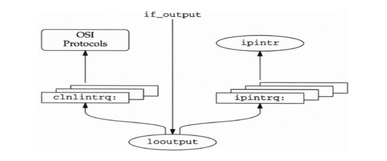
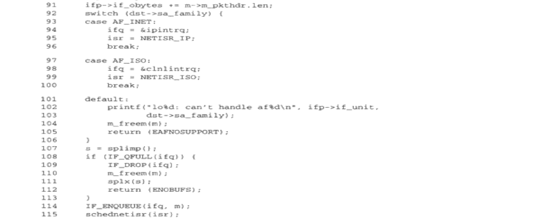

Loopback
========

Any packets sent to the loopback interface are immediately queued for input. The 
interface is implemented entirely in software. 

**looutput**, the **if_output** function for the loopback interface, places outgoing packets on the 
input queue for the protocol specified by the packet’s destination address. 

similar as **ether_input**, it jumps according to the Ethernet type field. 
For an IP packet, **schednetisr** schedules an IP software interrupt and 
the IP input queue, **ipintrq**, is selected. 

An isr is an interrupt service routine