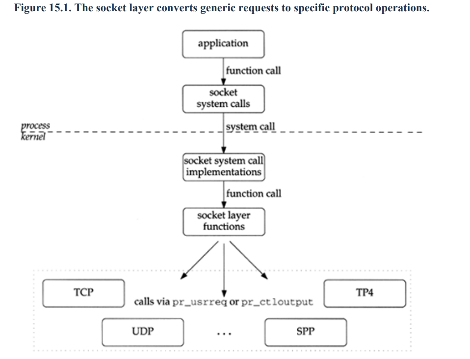
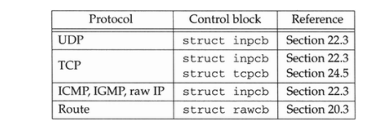
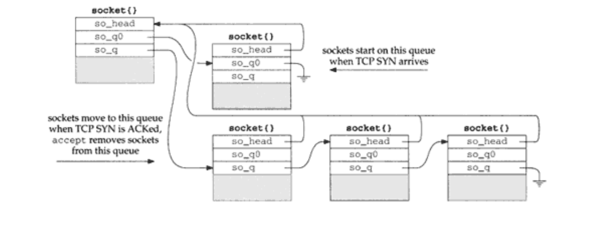
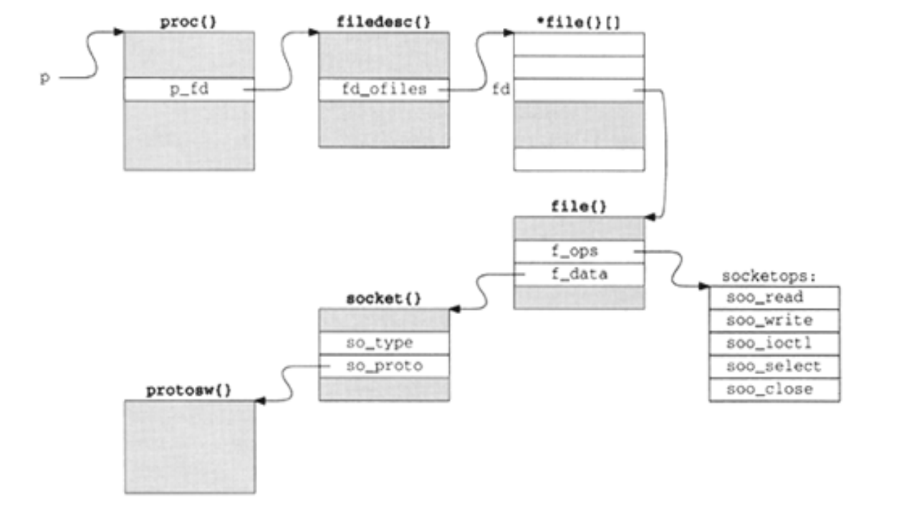

socket
======

The socket layer maps protocol-independent requests from a process to the 
protocol-specific implementation selected when the socket was created.

Network connections represented by sockets are accessed through a descriptor (a small integer) 
in the same way an open file is accessed through a descriptor. This allows the standard filesystem calls 
such as read and write, as well as network-specific system calls such as sendmsg and 
recvmsg, to work with a descriptor associated with a socket.

structure
---------

A socket represents one end of a communication link and holds or points to all the information 
associated with the link. This information includes the protocol to use, state information for the 
protocol, queues of arriving connections, data buffers, and option flags.

**so_type** is specified by the process creating a socket and identifies the communication semantics 
to be supported by the socket and the associated protocol.

**so_linger** is the time in clock ticks that a socket waits for data to drain while closing a 
connection

**so_pcb** points to a protocol control block that contains protocol-specific state information and 
parameters for the socket

**so_proto** points to the protosw structure of the protocol selected by the process

Sockets with **SO_ACCEPTCONN** set maintain two connection queues. Connections that are not yet 
established (e.g., the TCP three-way handshake is not yet complete) are placed on the queue 
so_q0. Connections that are established and are ready to be accepted (e.g., the TCP three-way 
handshake is complete) are placed on the queue so_q.

Each socket contains two data buffers, **so_rcv** and **so_snd**, used to buffer incoming and 
outgoing data

The proc structure represents the kernel's notion of a process. Within the proc structure,
p_fd points to a filedesc structure, which manages the descriptor table pointed to by fd_ofiles. 
The descriptor table is dynamically sized and consists of an array of pointers to file structures.
Each file structure describes a single open file and can be shared between multiple processes.

